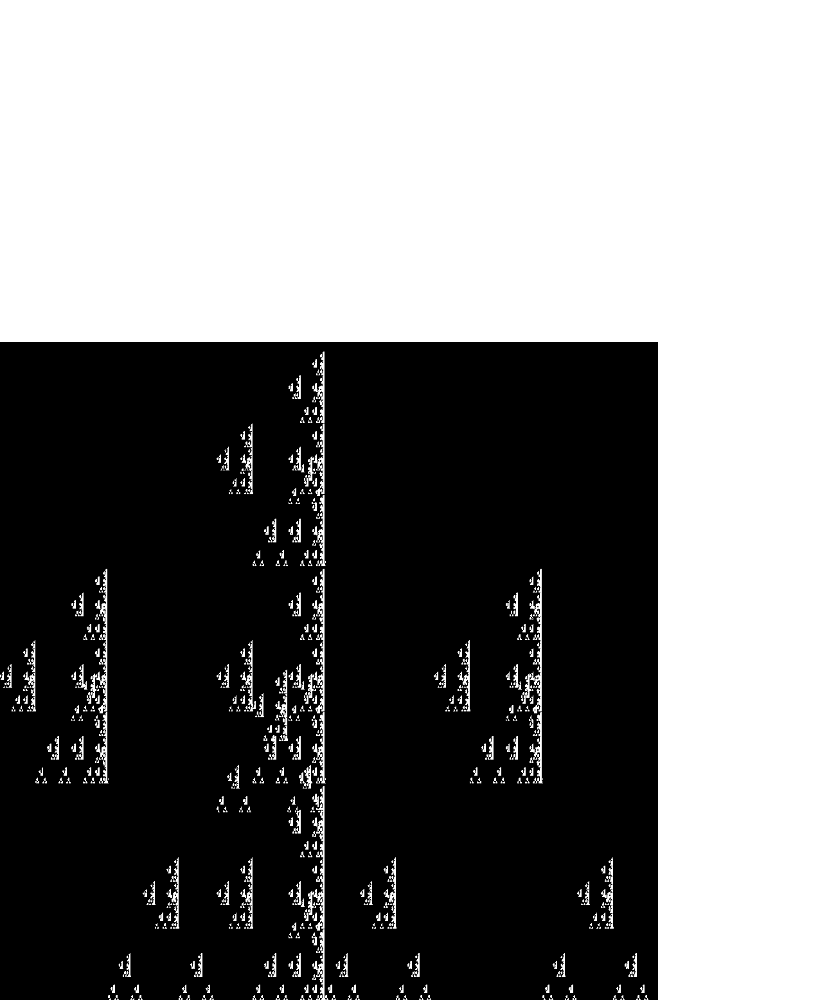
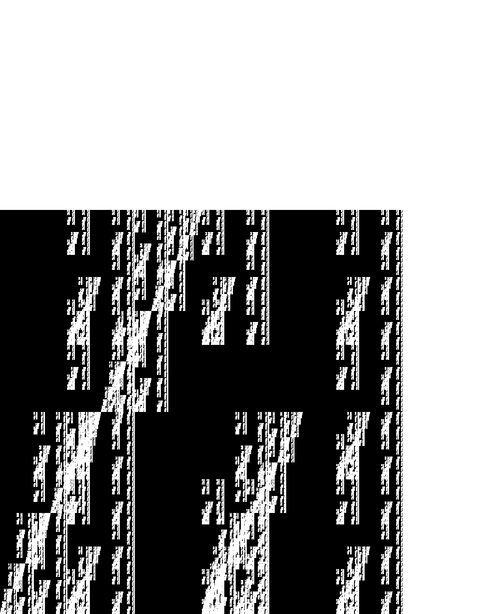

# Multifractal Visualizer

A GPU-accelerated fractal visualization tool that showcases the interplay between different fractal systems separated by a rotating dividing line.


*Animated visualization of the rotating boundary between Vicsek and Koch fractal systems*

## Features

- Real-time generation of fractals using OpenGL compute shaders
- Bit-packed representation for efficient memory usage
- Interactive boundary between two fractal systems that rotates over time
- Automatic image export at configurable iterations
- Full GPU acceleration for all fractal calculations

## Fractal Systems

This visualization alternates between:
- **Vicsek Fractal**: A cross-shaped fractal with five-fold symmetry
- **Koch Curve**: A triangular fractal pattern similar to snowflake formation

The boundary between these systems rotates over time, creating an interesting interplay between the two fractal types.

## Dependencies

- OpenGL 4.3+
- GLFW3
- GLAD
- stb_image_write.h (single-header library for PNG output)

## Building the Project

### First Time Setup

1. Clone the repository:
   ```bash
   git clone https://github.com/scottviteri/multifractal-visualizer.git
   cd multifractal-visualizer
   ```

2. Run the setup script to download required dependencies:
   ```bash
   make setup
   ```
   
3. For GLAD (OpenGL loader), visit [https://glad.dav1d.de/](https://glad.dav1d.de/) and:
   - Select OpenGL 4.3 or higher
   - Select "Core" profile
   - Check "Generate a loader"
   - Click "Generate"
   - Download the zip file
   - Place `glad.c` in the `src/` directory
   - Place the `glad/` folder in the `include/` directory

4. Install GLFW:
   - **Linux (Ubuntu/Debian)**: `sudo apt-get install libglfw3-dev`
   - **macOS**: `brew install glfw`
   - **Windows**: Download from [GLFW website](https://www.glfw.org/download.html) or use MSYS2/MinGW

### Building

After setup, build the project with:

```bash
make
```

### Running

```bash
make run
```

Or directly:

```bash
./fractal_visualizer
```

## Repository Structure

```
fractal-visualizer/
├── src/                # Source code
│   ├── main.cpp        # Main application code
│   └── glad.c          # GLAD OpenGL loader (you need to add this)
├── include/            # Header files
│   ├── glad/           # GLAD headers (you need to add this)
│   └── stb_image_write.h # Image writing library
├── Makefile            # Build configuration
└── README.md           # This file
```

## GitHub Repository Guidelines

When committing this project to GitHub:

1. **Do include** the `include/stb_image_write.h` file as it's a single-header library that's easy to distribute
2. **Do not include** the GLAD files in your commits - each user should generate these for their specific system
3. Add the following to your `.gitignore`:
   ```
   multifractal_visualizer
   src/glad.c
   include/glad/
   ```

## Images

Sample fractal visualizations are included in the repository's `output` folder:


*Vicsek and Koch fractal systems at 500 iterations*


*Sierpinski triangle and carpet fractal systems at 500 iterations*

## License

[MIT License](LICENSE)

## Acknowledgments

- [GLFW](https://www.glfw.org/) for window creation and OpenGL context management
- [GLAD](https://github.com/Dav1dde/glad) for OpenGL function loading
- [stb](https://github.com/nothings/stb) for the image writing library 